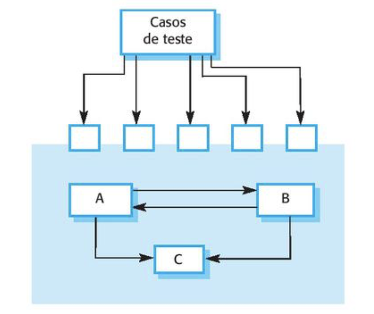

<!-- .slide:  data-background-opacity="0.1" data-background-image="https://media.itpro.co.uk/image/upload/v1570816546/itpro/2019/02/software_shutterstock_1290773869.jpg"
data-transition="convex"  -->
# Testes de componentes 🚀
<!-- .element: style="margin-bottom:100px; font-size: 50px; color:white; font-family: Marker Felt;" -->

Pressione 'F' para tela cheia
<!-- .element: style="font-size: small; color:white;" -->

[versão em pdf](?print-pdf)
<!-- .element: style="font-size: small;" -->

<!-- .slide: data-background="#185449" data-transition="convex"  -->
## Componentes 🏠
<!-- .element: style="margin-bottom:50px; font-size: 40px; font-family: Marker Felt; color:#F5F5F5" -->

* Os componentes de software consistem frequentemente em vários objetos que interagem entre sí. 😊
<!-- .element: style="margin-bottom:50px; font-size: 23px; font-family: arial; color:#F5F5F5" -->

* O teste de componente deve se concentrar em mostrar que a interface (ou interfaces) do componente se comporta de acordo com a sua especificação, por exemplo:
<!-- .element: style="margin-bottom:25px; font-size: 23px; font-family: arial; color:#F5F5F5" -->

<!-- .element: style="height: 250px; margin-top: 20px" -->

Fonte: SOMMERVILLE, Ian. [Engenharia de software](https://biblioteca.ifrs.edu.br/pergamum_ifrs/biblioteca_s/acesso_login.php?cod_acervo_acessibilidade=5030950&acesso=aHR0cHM6Ly9taWRkbGV3YXJlLWJ2LmFtNC5jb20uYnIvU1NPL2lmcnMvOTc4ODU0MzAyNDk3NA==&label=acesso%20restrito), 10ª ed., Editora Pearson, cap. 8., Figura 8.7.
<!-- .element: style="margin-bottom:25px; font-size: 10px; font-family: arial; color:#F5F5F5" -->

<!-- .slide: data-background="#185449" data-transition="convex"  -->
## Tipos de interface 🖱️
<!-- .element: style="margin-bottom:50px; font-size: 40px; font-family: Marker Felt; color:#F5F5F5" -->

* **Interface de parâmetro:** são interfaces onde passamos dados ou referências a funções de um componente para o outro.
<!-- .element: style="margin-bottom:40px; font-size: 18px; font-family: arial; color:#F5F5F5" -->

* **Interface de memória compartilhada:** são interfaces nas quais um bloco de memória é compartilhado por um componente. Os dados são colocamos na memória por um subsistema e recuperados por outro subsistema (por exemplo: em sistemas embarcados).
<!-- .element: style="margin-bottom:40px; font-size: 18px; font-family: arial; color:#F5F5F5" -->

* **Interface de procedimento:** são interfaces em que um component encapsula um conjunto de procedimentos. Objetos e/ou componentes reusáveis têm esse formato de interface.
<!-- .element: style="margin-bottom:40px; font-size: 18px; font-family: arial; color:#F5F5F5" -->

* **Interface de passagem de mensagens:** são interfaces em que um componente solicita um serviço de outro componente por meio da passagem de uma mensagem (por exemplo: um Web services).
<!-- .element: style="margin-bottom:20px; font-size: 18px; font-family: arial; color:#F5F5F5" -->

<!-- .slide: data-background="#185449" data-transition="convex"  -->
## Erros de interfaces 🐛
<!-- .element: style="margin-bottom:50px; font-size: 40px; font-family: Marker Felt; color:#F5F5F5" -->

* **Mau uso da interface:** Um componente chama outro componente e comete um erro no uso de sua interface. Por exemplo, enviar dados errados (tipo, ordem, valores, etc.) em uma interface de parâmetro.
<!-- .element: style="margin-bottom:50px; font-size: 22px; font-family: arial; color:#F5F5F5" -->

* **Má compreensão da interface:** Um componente não compreende a interface e faz suposições sobre o seu comportamento.
<!-- .element: style="margin-bottom:50px; font-size: 22px; font-family: arial; color:#F5F5F5" -->

* **Erros de temporização:** Um componente, por possuir uma velocidade diferente, pode consumir dados obsoletos.
<!-- .element: style="margin-bottom:50px; font-size: 22px; font-family: arial; color:#F5F5F5" -->

<!-- .slide:  data-background-opacity="0.9" data-background-image="img/dicas.png" data-transition="zoom"  -->

<!-- .slide: data-background="#185449" data-transition="convex"  -->
# Referências 📚
<!-- .element: style="margin-bottom:50px; font-size: 40px; font-family: Marker Felt; color:#F5F5F5" -->

SOMMERVILLE, Ian. [Engenharia de software](https://biblioteca.ifrs.edu.br/pergamum_ifrs/biblioteca_s/acesso_login.php?cod_acervo_acessibilidade=5030950&acesso=aHR0cHM6Ly9taWRkbGV3YXJlLWJ2LmFtNC5jb20uYnIvU1NPL2lmcnMvOTc4ODU0MzAyNDk3NA==&label=acesso%20restrito), 10ª ed., Editora Pearson, cap. 8 ISBN 9788543024974.
<!-- .element: style="margin-bottom:50px; font-size: 23px; font-family: arial; color:#F5F5F5" -->

SOMMERVILLE, Ian. [Slides](https://iansommerville.com/software-engineering-book/slides/) do capítulo 8 (em inglês).
<!-- .element: style="margin-bottom:50px; font-size: 23px; font-family: arial; color:#F5F5F5" -->

SOMMERVILLE, Ian. [Vídeos](https://iansommerville.com/software-engineering-book/videos/imp/) do capítulo 8 (em inglês).
<!-- .element: style="margin-bottom:40px; font-size: 23px; font-family: arial; color:#F5F5F5" -->

 
<a rel="license" href="http://creativecommons.org/licenses/by/4.0/">Creative Commons Atribuição 4.0 Internacional</a>

<!-- .element: style="margin-top:150px; font-size: 15px; font-family: Bradley Hand" -->