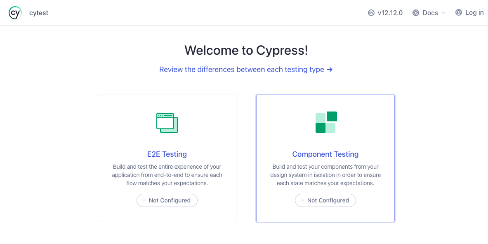
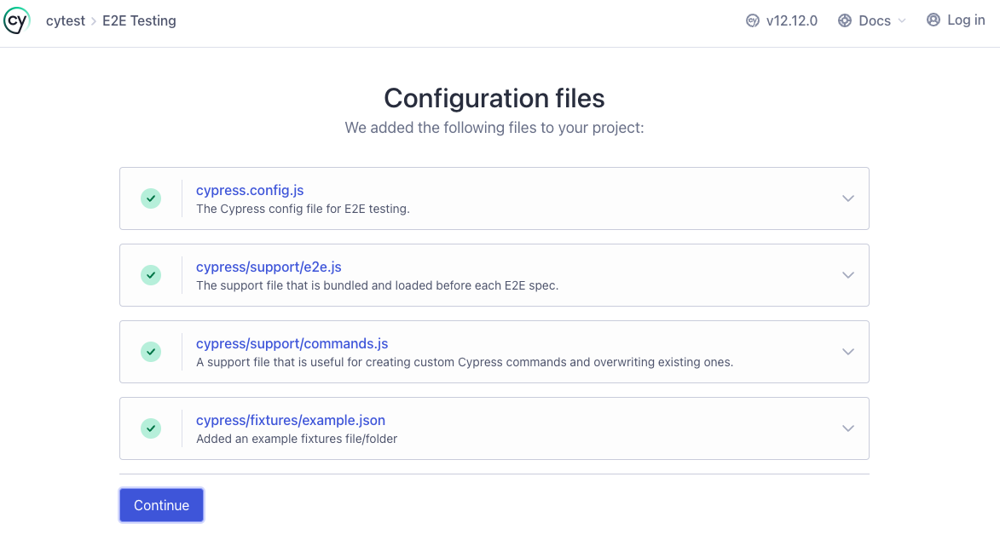
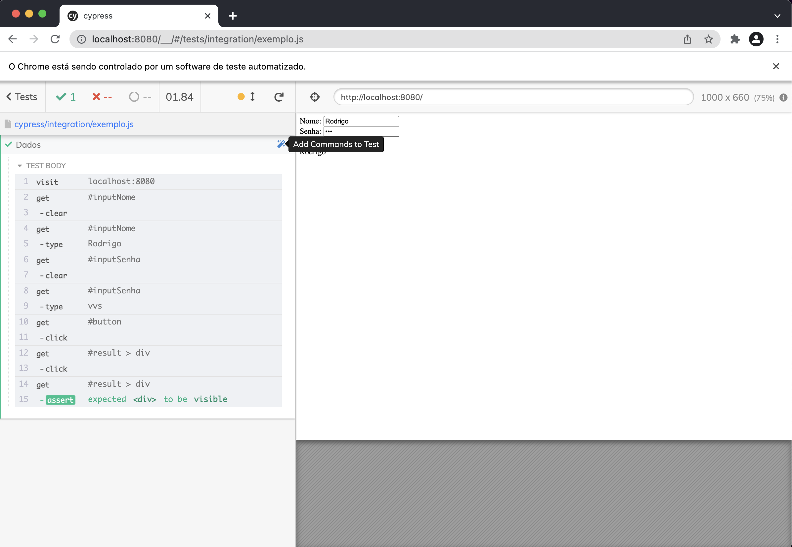

# Cypress

O foco de um teste de sistema deve se concentrar na interação entre os
componentes. Assim como o [Selenium](https://www.selenium.dev) o
[Cypress](https://www.cypress.io) é uma ferramenta que permite que a construção
de testes de sistemas com interface Web. Porém, por ser uma ferramenta baseada
no [NodeJS](https://nodejs.org), o Cypress fornece uma curva de aprendizado
bastante interessante.

Ao contrário de outras ferramentas de teste, o Cypress é executado diretamente
no navegador, permitindo que ele interaja com o aplicativo da web em tempo real.
Isso permite que os testes sejam executados de maneira rápida, permitindo que os
desenvolvedores e testadores vejam os resultados imediatamente.

O Cypress também tem uma API e oferece recursos avançados, como captura de vídeo
dos testes, debug interativo, e simulação de interações com usuários, como
clique e digitação. Ele suporta várias linguagens de programação, como
JavaScript e TypeScript, e oferece integração com muitas ferramentas de
desenvolvimento populares, como o framework de testes Mocha e o gerenciador de
dependências NPM.

Um projeto com o Cypress pode ser criado da seguinte maneira:

    mkdir yourproject
    cd yourproject
    npm install cypress --save-dev

Uma vez instalado, o cypress pode ser aberto por meio do comando:

     ./node_modules/.bin/cypress open

Depois de aberto, o Cypress mostra uma tela onde podemos selecionar o topo de
projeto que iremos realizar E2E ou componentes, a figura 1 ilustra essa tela:

<center>
  <br/>
  Figura 1 - Cypress
</center>

Iremos focar nos testes E2E, por isso, selecione a opção "E2E Testing". O Cypress
irá criar uma estrutura de diretórios e arquivos conforme apresenta a figura 2.

<center>
  <br/>
  Figura 2 - Arquivos de configuração do E2E no Cypress
</center>

Os testes E2E são testes que simulam a interação do usuário com a aplicação.
Este tipo de teste pode ser executados com o Chrome e/ou
[Electron](https://www.electronjs.org). Os testes E2E no Cypress são chamados de
`specs` e são armazenados no diretório `cypress/e2e`.

<center>
<br/>
Figura 2 - Navegador Chrome com o Cypress
</center>

## Cypress Studio

A forma mais fácil de se criar um teste é interagir com a interface para poder
gravar. Para isso, se faz necessário habilitar uma funcionalidade chamada
"Cypress Studio". Para isto, adicione o comandoNo abaixo no arquivo
`cypress.config.js` :

```json
e2e: {
    experimentalStudio: true,
}
```

Além de permitir gravar a interação com a página, o Cypress Studio também
permite que você crie assertivas.

## Gravando um vídeo

O Cypress permite que você grave um vídeo da execução dos testes. Para isso,
adicione o comando abaixo no arquivo `cypress.config.js` :

```json
e2e: {
    video: true,
}
```

## Rodando os testes

Dependendo da aplicação, temos que iniciar um servidor HTTP para podermos rodar
os testes. Existe um pacote do npm chamado
[http-server](https://www.npmjs.com/package/http-server) que pode auxiliar nessa
função. O trecho abaixo apresenta um exemplo de configuração de um projeto node
(package.json) onde o servidor HTTP está configurado para rodar quando o comando
`npm start` for chamado (na linha de comando e no mesmo diretório de um projeto
node).

Outra dica. Dependendo da aplicação, você deve esperar que o servidor HTTP suba
para que os testes possam ser executados. Existe um outro pacote npm chamado
[start-server-and-test](https://www.npmjs.com/package/start-server-and-test) que
espera que um servidor esteja pronto para depois iniciar os testes. Novamente,
observe o código abaixo, quando o comando `npm test` for executado, o script
 `start-server-and-test` irá dar um `start` em um servidor HTTP, esperar que a
 URL `http://localhost:8080` esteja disponível e depois executar os testes por
 meio do comando `cy:run`.

```json
{
  "scripts": {
    "start": "http-server",
    "cy:run": "cypress run --browser chrome",
    "test": "start-server-and-test start http://localhost:8080 cy:run"
  },
  "devDependencies": {
    "cypress": "^9.1.1",
    "start-server-and-test": "^1.14.0"
  },
  "dependencies": {
    "http-server": "^14.0.0"
  }
}
```

Se você estiver num projeto node configurado adequadamente, para executar os
testes na linha de comando basta digitar:

    npm test

## Exemplo de código 💡

Um exemplo de projeto node simples que utiliza o Cypress pode ser encontrado em:

```sh
  git clone -b dev https://github.com/rodrigoprestesmachado/vvs
  code exemplos/cypress
```

# Referências 📚

Cypress. Disponível em: [https://www.cypress.io](https://www.cypress.io)

<center>
<a href="https://rpmhub.dev" target="blanck"></a><br/>
<a rel="license" href="http://creativecommons.org/licenses/by/4.0/">Creative Commons Atribuição 4.0 Internacional</a>
</center>