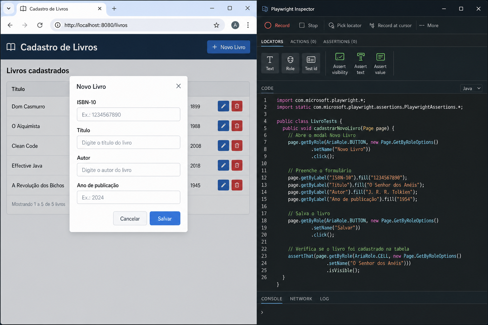

## 1. Visão geral

O [Playwright](https://playwright.dev) é uma ferramenta de teste de sistema
desenvolvida pela Microsoft que permite construir testes end to end com
interface Web. Assim como o [Selenium](https://www.selenium.dev), ele simula a
interação de um usuário com a aplicação no navegador.

Esta documentação usa como exemplo o frontend do projeto hexagonal de cadastro
de livros, disponível em `exemplos/hexagonal/frontend`. A aplicação é uma SPA
Vue 3 servida pelo backend Quarkus em `http://localhost:8080` e oferece as
operações de cadastro, edição, exclusão e listagem de livros.

### 1.1. Por que usar o Playwright?

| Característica | Descrição |
|---|---|
| Multi navegador | Suporta Chromium (Chrome/Edge), Firefox e WebKit (Safari) com a mesma API |
| Multi linguagem | JavaScript, TypeScript, Python, Java e .NET |
| Auto wait | Aguarda automaticamente que elementos estejam prontos antes de agir |
| Execução paralela | Roda múltiplos testes simultaneamente |
| Recursos de depuração | Trace viewer, modo UI, screenshots e gravação de vídeo |
| Codegen | Gera código automaticamente a partir da interação com a página |

### 1.2. Pré-requisitos

- [Java 25](https://openjdk.org) (versão fixada em `maven.compiler.release` no
  `pom.xml` do projeto hexagonal)
- [Maven 3.9](https://maven.apache.org) ou superior (o módulo inclui `./mvnw`,
  não é necessário instalar Maven globalmente)
- [Docker](https://www.docker.com/) em execução — a anotação `@QuarkusTest`
  sobe o Quarkus e o MySQL Dev Services automaticamente ao rodar os testes,
  então **não é preciso** iniciar `./mvnw quarkus:dev` antes

---

## 2. Configuração do projeto Maven

Este tutorial usa o projeto `exemplos/hexagonal`. O `pom.xml` desse módulo já
traz tudo o que é necessário para gravar testes com o Codegen e executá-los
com JUnit 5 — você não precisa adicionar nada para começar.

### 2.1. Estrutura de arquivos de teste

Os testes E2E em Java vivem ao lado dos demais testes do módulo hexagonal:

```
exemplos/hexagonal/
├── src/test/java/dev/ifrs/hexagonal/
│   ├── BooksE2ETest.java
│   └── BooksMultiBrowserTest.java
├── src/test/resources/
│   └── junit-platform.properties
└── pom.xml
```

### 2.2. O que já está pronto no projeto

O arquivo completo está em [`exemplos/hexagonal/pom.xml`](https://github.com/rodrigoprestesmachado/vvs/blob/dev/exemplos/hexagonal/pom.xml).
Tudo o que o tutorial precisa já está configurado:

| Item | Onde está |
|---|---|
| Dependência Playwright Java (`1.52.0`) | bloco `<dependencies>` do `pom.xml` |
| Dependência `quarkus-junit` (traz JUnit Jupiter via BOM Quarkus 3.34.1) | bloco `<dependencies>` do `pom.xml` |
| Dependência `rest-assured` (para pré-condições REST nos testes E2E) | bloco `<dependencies>` do `pom.xml` |
| Plugin `maven-surefire-plugin` (gera relatórios JUnit XML) | bloco `<build><plugins>` do `pom.xml` |
| Plugin `exec-maven-plugin` (permite chamar o CLI do Playwright) | bloco `<build><plugins>` do `pom.xml` |
| Perfil `e2e` | bloco `<profiles>` do `pom.xml` (executa testes Playwright em **JavaScript** no frontend) |
| `quarkus.http.test-port=8080` | `src/main/resources/application.properties` |

> Não fixe uma versão de `junit-jupiter` no `pom.xml`: o `quarkus-junit` já a
> resolve via BOM Quarkus, e declarar manualmente costuma criar conflito de
> classes.

> A propriedade `quarkus.http.test-port=8080` é o que faz o `@QuarkusTest`
> subir a aplicação na porta `8080` durante os testes (o padrão do Quarkus em
> teste é `8081`). Sem ela, as URLs `http://localhost:8080` deste tutorial não
> funcionariam.

### 2.3. Instalação dos navegadores

Na raiz do módulo hexagonal, baixe os binários dos navegadores. Esse passo é
necessário somente uma vez por máquina:

```sh
cd exemplos/hexagonal
./mvnw exec:java -e \
  -D exec.mainClass=com.microsoft.playwright.CLI \
  -D exec.args="install"
```

---

## 3. Gravando o primeiro teste

A forma mais rápida de começar é **gravar a interação** com a interface, sem
escrever código. O **Codegen** abre o navegador, observa o que você faz e gera
o Java automaticamente. Só depois de gravar é que vamos entender o código na
seção 4.

### 3.1. Preparando o ambiente

O Codegen precisa de uma aplicação rodando para gravar a interação. Como o
`@QuarkusTest` só sobe o backend durante a execução dos testes, para esta
sessão de gravação inicial vamos subir o Quarkus manualmente:

```sh
cd exemplos/hexagonal
./mvnw quarkus:dev
```

Com a aplicação em `http://localhost:8080`, abra o Codegen com saída em Java
(em outro terminal, na raiz do módulo hexagonal):

```sh
cd exemplos/hexagonal
./mvnw exec:java -e \
  -D exec.mainClass=com.microsoft.playwright.CLI \
  -D exec.args="codegen --target java http://localhost:8080"
```

Duas janelas aparecem lado a lado:

1. **Navegador**, onde você interage normalmente (clica, digita, navega).
2. **Playwright Inspector**, painel que exibe o código Java em tempo real.

<center>
  <br/>
  Figura 1 — Codegen: navegador (esquerda) e Inspector (direita)
</center>

### 3.2. O que gravar

Vamos registrar o cadastro de um livro. No navegador, siga estes passos enquanto
o Inspector gera o código:

1. Clique em **Novo livro**.
2. Preencha o ISBN com `156881111X`.
3. Preencha o título com `Erdős on Graphs: His Legacy of Unsolved Problems`.
4. Preencha o autor com `Fan Chung, Ronald L. Graham`.
5. Preencha o ano com `1999`.
6. Clique em **Salvar**.
7. Verifique que a linha com o ISBN aparece na tabela (use o botão de assertiva
   do Inspector, descrito na seção 3.4).

Cada clique e cada texto digitado vira uma linha de código Java no Inspector.

### 3.3. Fluxo de gravação passo a passo

1. **Inicie a gravação.** Assim que o Codegen abre, ele já está gravando
   (ícone vermelho ativo no Inspector).
2. **Interaja com a página.** Clique em botões, preencha formulários e navegue
   normalmente. Cada ação vira uma linha de código Java.
3. **Adicione assertivas.** Use os botões da barra do Inspector (seção 3.4).
4. **Pause se necessário.** Clique no botão vermelho para pausar ou retomar.
5. **Copie o código.** Clique em **Copy** no Inspector. Guarde o resultado;
   vamos analisar o conteúdo na seção 4.

### 3.4. Criando assertivas durante a gravação

O Inspector possui três botões para criar assertivas sem escrever código:

| Botão | Método gerado | O que verifica |
|---|---|---|
| Assert visibility | `assertThat(locator).isVisible()` | O elemento está visível na tela |
| Assert text | `assertThat(locator).hasText(...)` | O elemento contém o texto esperado |
| Assert value | `assertThat(locator).hasValue(...)` | Um campo de formulário tem o valor esperado |

**Como usar:** clique no botão da assertiva desejada e, em seguida, clique
sobre o elemento na página. A linha é adicionada automaticamente ao código.

Para o cadastro de livros, use **Assert visibility** sobre a linha da tabela
que contém o ISBN `156881111X`.

### 3.5. Opções úteis da linha de comando

| Opção | Exemplo | Descrição |
|---|---|---|
| `--browser` | `--browser firefox` | Navegador alvo (chromium, firefox, webkit) |
| `--output` | `--output src/test/java/CadastroLivroGravado.java` | Salva direto em arquivo |
| `--target` | `--target java` | Linguagem de saída |
| `--device` | `--device "iPhone 13"` | Emula um dispositivo móvel |
| `--lang` | `--lang "pt-BR"` | Idioma do navegador |

Para salvar a gravação direto no projeto:

```sh
cd exemplos/hexagonal
./mvnw exec:java -e \
  -D exec.mainClass=com.microsoft.playwright.CLI \
  -D exec.args="codegen --target java --output src/test/java/dev/ifrs/hexagonal/CadastroLivroGravado.java http://localhost:8080"
```

---

## 4. Entendendo o código gerado

Depois de gravar, o Inspector exibe um arquivo Java completo. Antes de evoluir
para testes mais complexos, vale entender o que cada parte faz.

### 4.1. Código completo gerado pelo Codegen

O trecho abaixo corresponde ao fluxo gravado na seção 3 (cadastro de um livro
e verificação na tabela):

```java
import com.microsoft.playwright.*;
import com.microsoft.playwright.options.*;
import static com.microsoft.playwright.options.AriaRole.*;
import static com.microsoft.playwright.assertions.PlaywrightAssertions.assertThat;

public class CadastroLivroGravado {
    public static void main(String[] args) {
        try (Playwright playwright = Playwright.create()) {
            Browser browser = playwright.chromium().launch(
                new BrowserType.LaunchOptions().setHeadless(false)
            );
            BrowserContext context = browser.newContext();
            Page page = context.newPage();

            page.navigate("http://localhost:8080");

            page.getByRole(BUTTON, new Page.GetByRoleOptions().setName("Novo livro")).click();
            page.getByRole(TEXTBOX, new Page.GetByRoleOptions().setName("ISBN-")).fill("156881111X");
            page.getByRole(TEXTBOX, new Page.GetByRoleOptions().setName("Título")).fill(
                "Erdős on Graphs: His Legacy of Unsolved Problems"
            );
            page.getByRole(TEXTBOX, new Page.GetByRoleOptions().setName("Autor")).fill(
                "Fan Chung, Ronald L. Graham"
            );
            page.getByRole(SPINBUTTON, new Page.GetByRoleOptions().setName("Ano de publicação"))
                .fill("1999");
            page.getByRole(BUTTON, new Page.GetByRoleOptions().setName("Salvar")).click();

            assertThat(
                page.getByRole(ROW).filter(
                    new Locator.FilterOptions().setHasText("156881111X"))
            ).isVisible();
        }
    }
}
```

### 4.2. Anatomia do código

| Trecho | O que faz |
|---|---|
| `Playwright.create()` | Inicia o processo interno do Playwright |
| `playwright.chromium().launch(...)` | Abre o navegador Chromium (visível com `setHeadless(false)`) |
| `browser.newContext()` | Cria um perfil isolado: cookies, storage e estado próprios |
| `context.newPage()` | Abre uma aba dentro do contexto |
| `page.navigate(url)` | Navega para a URL informada |
| `page.getByRole(...).click()` | Localiza um elemento pelo papel ARIA e clica |
| `page.getByRole(...).fill(...)` | Localiza um campo e preenche com texto |
| `assertThat(...).isVisible()` | Assertiva com auto wait: aguarda o elemento aparecer |
| `try (Playwright playwright = ...)` | Garante que todos os recursos sejam fechados ao final |

### 4.3. Seletores usados na gravação

O Codegen prioriza seletores **semânticos**, baseados em como o usuário enxerga
a interface. Isso torna os testes mais robustos a mudanças de layout:

| Prioridade | Método | Exemplo em Java |
|---|---|---|
| 1ª | `getByRole()` | `page.getByRole(AriaRole.BUTTON, new Page.GetByRoleOptions().setName("Salvar"))` |
| 2ª | `getByText()` | `page.getByText("Nenhum livro cadastrado")` |
| 3ª | `getByLabel()` | `page.getByLabel("Título")` |
| 4ª | `getByPlaceholder()` | `page.getByPlaceholder("Ex.: 1-56881-111-X")` |
| 5ª | `getByTestId()` | `page.getByTestId("btn-salvar")` |
| Fallback | `locator()` (CSS) | `page.locator("#isbn")` |

No cadastro de livros, o Codegen escolheu `getByRole` para botões, campos de
texto e linhas da tabela porque a interface Vue expõe papéis ARIA nos elementos.

### 4.4. Adaptando a gravação para `@QuarkusTest` + `@UsePlaywright`

O Codegen gera um `main()` executável. Para integrar ao Maven, gerar relatório
JUnit XML e subir o Quarkus automaticamente, o projeto hexagonal usa duas
anotações que substituem todo o ciclo `@BeforeAll`/`@BeforeEach`/`@AfterAll`:

- **`@QuarkusTest`** (de `io.quarkus.test.junit`) — sobe o Quarkus e o MySQL
  Dev Services antes de qualquer teste, na porta configurada por
  `quarkus.http.test-port=8080`.
- **`@UsePlaywright`** (de `com.microsoft.playwright.junit`) — gerencia
  `Playwright`, `Browser` e `BrowserContext`, e injeta um `Page` novo a cada
  método `@Test` (cada teste recebe um contexto isolado, com cookies e
  storage limpos).

A classe de teste fica reduzida ao essencial:

```java
package dev.ifrs.hexagonal;

import com.microsoft.playwright.Locator;
import com.microsoft.playwright.Page;
import com.microsoft.playwright.junit.UsePlaywright;
import com.microsoft.playwright.options.AriaRole;
import static com.microsoft.playwright.assertions.PlaywrightAssertions.assertThat;

import io.quarkus.test.junit.QuarkusTest;
import org.junit.jupiter.api.Test;

@QuarkusTest
@UsePlaywright
public class BooksE2ETest {

    @Test
    void cadastraLivro(Page page) {
        page.navigate("http://localhost:8080/");

        page.getByRole(AriaRole.BUTTON,
            new Page.GetByRoleOptions().setName("Novo livro")).click();
        page.getByRole(AriaRole.TEXTBOX,
            new Page.GetByRoleOptions().setName("ISBN-")).fill("156881111X");
        page.getByRole(AriaRole.TEXTBOX,
            new Page.GetByRoleOptions().setName("Título")).fill(
                "Erdős on Graphs: His Legacy of Unsolved Problems");
        page.getByRole(AriaRole.TEXTBOX,
            new Page.GetByRoleOptions().setName("Autor")).fill(
                "Fan Chung, Ronald L. Graham");
        page.getByRole(AriaRole.SPINBUTTON,
            new Page.GetByRoleOptions().setName("Ano de publicação")).fill("1999");
        page.getByRole(AriaRole.BUTTON,
            new Page.GetByRoleOptions().setName("Salvar")).click();

        assertThat(
            page.getByRole(AriaRole.ROW).filter(
                new Locator.FilterOptions().setHasText("156881111X"))
        ).isVisible();
    }
}
```

| Elemento | Função |
|---|---|
| `@QuarkusTest` | Sobe o Quarkus + MySQL Dev Services em `http://localhost:8080` antes dos testes |
| `@UsePlaywright` | Inicia o Playwright, abre o navegador (Chromium em modo headless) e cria um `BrowserContext` por método de teste |
| `Page page` no parâmetro do `@Test` | O Playwright injeta automaticamente a página vinda do contexto isolado |
| `@Test` | Marca o método como caso de teste JUnit 5 |

Se quiser **acompanhar visualmente** (modo headed, útil para depuração local),
forneça uma `OptionsFactory` em `@UsePlaywright`:

```java
import com.microsoft.playwright.junit.Options;
import com.microsoft.playwright.junit.OptionsFactory;

@QuarkusTest
@UsePlaywright(BooksE2ETest.HeadedOptions.class)
public class BooksE2ETest {

    public static class HeadedOptions implements OptionsFactory {
        @Override
        public Options getOptions() {
            return new Options().setHeadless(false);
        }
    }

    // ... métodos @Test ...
}
```

Execute com `./mvnw test` na raiz do módulo hexagonal. O relatório XML será
gerado em `target/surefire-reports/` (conforme a seção 6).

---

## 5. Exemplos completos: CRUD de livros

Com a estrutura `@QuarkusTest` + `@UsePlaywright` em mãos, esta seção mostra
testes para as demais operações do cadastro de livros.

Cada `@Test` recebe um `Page` novo (em um `BrowserContext` isolado), mas
**todos compartilham o mesmo banco MySQL** durante a execução de uma mesma
classe. Para que os testes sejam independentes da ordem de execução,
declaramos um `@BeforeEach` que apaga o ISBN de teste via REST antes de cada
caso (404 é ignorado):

```java
import io.restassured.http.ContentType;
import static io.restassured.RestAssured.given;
import org.junit.jupiter.api.BeforeEach;

@BeforeEach
void limparLivroDeTeste() {
    given().delete("/books/156881111X");
}
```

Para os cenários que dependem de um livro já existente (`editaLivro` e
`excluiLivro`), o próprio teste cadastra a pré-condição via `POST /books` —
mais rápido e mais robusto do que cadastrar pela UI a cada execução.

### 5.1. Cadastrar um livro

Os passos abaixo replicam exatamente a gravação da seção 3, com uma verificação
extra: a mensagem de sucesso exibida após salvar (o elemento de `role="status"`
no `App.vue`):

```java
@Test
void cadastraLivroComMensagemDeSucesso(Page page) {
    page.navigate("http://localhost:8080/");

    page.getByRole(AriaRole.BUTTON,
        new Page.GetByRoleOptions().setName("Novo livro")).click();

    page.getByRole(AriaRole.TEXTBOX,
        new Page.GetByRoleOptions().setName("ISBN-")).fill("156881111X");
    page.getByRole(AriaRole.TEXTBOX,
        new Page.GetByRoleOptions().setName("Título")).fill(
            "Erdős on Graphs: His Legacy of Unsolved Problems");
    page.getByRole(AriaRole.TEXTBOX,
        new Page.GetByRoleOptions().setName("Autor")).fill(
            "Fan Chung, Ronald L. Graham");
    page.getByRole(AriaRole.SPINBUTTON,
        new Page.GetByRoleOptions().setName("Ano de publicação")).fill("1999");

    page.getByRole(AriaRole.BUTTON,
        new Page.GetByRoleOptions().setName("Salvar")).click();

    assertThat(
        page.getByRole(AriaRole.ROW).filter(
            new Locator.FilterOptions().setHasText("156881111X"))
    ).isVisible();

    assertThat(
        page.getByRole(AriaRole.STATUS)
    ).hasText("Livro criado com sucesso.");
}
```

### 5.2. Editar um livro

O campo ISBN fica desabilitado na edição (`disabled` no `<input>` do
`App.vue`); somente os demais campos podem ser alterados. O teste cria a
pré-condição via REST antes de abrir a UI e verifica que o título atualizado
aparece na tabela após salvar:

```java
@Test
void editaLivro(Page page) {
    // Pré-condição via REST: garante o livro no banco antes de abrir a UI
    given()
        .contentType(ContentType.JSON)
        .body("""
            {
              "isbn": "156881111X",
              "title": "Erdős on Graphs: His Legacy of Unsolved Problems",
              "author": "Fan Chung, Ronald L. Graham",
              "publicationYear": 1999,
              "copiesAvailable": 1
            }
            """)
        .post("/books")
        .then().statusCode(201);

    page.navigate("http://localhost:8080/");

    page.getByRole(AriaRole.ROW)
        .filter(new Locator.FilterOptions().setHasText("156881111X"))
        .getByRole(AriaRole.BUTTON,
            new Locator.GetByRoleOptions().setName("Editar"))
        .click();

    Locator campoTitulo = page.getByRole(AriaRole.TEXTBOX,
        new Page.GetByRoleOptions().setName("Título"));
    campoTitulo.clear();
    campoTitulo.fill("Erdős on Graphs (2ª edição)");

    page.getByRole(AriaRole.BUTTON,
        new Page.GetByRoleOptions().setName("Salvar")).click();

    assertThat(
        page.getByRole(AriaRole.ROW)
            .filter(new Locator.FilterOptions()
                .setHasText("Erdős on Graphs (2ª edição)"))
    ).isVisible();
}
```

### 5.3. Excluir um livro

A exclusão exibe um diálogo de confirmação nativo do navegador
(`window.confirm` em `App.vue`). O Playwright permite aceitar ou rejeitar
esse diálogo antes de clicar no botão. Repare que o handler de diálogo é
registrado **antes** do clique para garantir que esteja ativo no momento em
que o `confirm` aparece:

```java
@Test
void excluiLivro(Page page) {
    // Pré-condição via REST
    given()
        .contentType(ContentType.JSON)
        .body("""
            {
              "isbn": "156881111X",
              "title": "Erdős on Graphs: His Legacy of Unsolved Problems",
              "author": "Fan Chung, Ronald L. Graham",
              "publicationYear": 1999,
              "copiesAvailable": 1
            }
            """)
        .post("/books")
        .then().statusCode(201);

    page.navigate("http://localhost:8080/");

    // Aceita o diálogo de confirmação automaticamente
    page.onDialog(dialog -> dialog.accept());

    page.getByRole(AriaRole.ROW)
        .filter(new Locator.FilterOptions().setHasText("156881111X"))
        .getByRole(AriaRole.BUTTON,
            new Locator.GetByRoleOptions().setName("Excluir"))
        .click();

    // Verifica que a linha sumiu da tabela
    assertThat(
        page.getByRole(AriaRole.ROW)
            .filter(new Locator.FilterOptions().setHasText("156881111X"))
    ).not().isVisible();

    assertThat(
        page.getByRole(AriaRole.STATUS)
    ).hasText("Livro removido com sucesso.");
}
```

---

## 6. Integração com Maven e exportação JUnit

O Maven Surefire gera automaticamente relatórios no formato XML do JUnit após
cada execução de `mvn test`. Esses arquivos são o padrão aceito por ferramentas
de integração contínua (Jenkins, GitHub Actions, GitLab CI, etc.).

### 6.1. Executar os testes via Maven

A classe `BooksE2ETest` roda no ciclo `test` padrão (a anotação `@QuarkusTest`
sobe o Quarkus + MySQL Dev Services automaticamente). Na raiz do módulo
hexagonal:

```sh
cd exemplos/hexagonal
./mvnw test -Dtest=BooksE2ETest
```

O Surefire executa os métodos anotados com `@Test` e grava os relatórios em
`target/surefire-reports/`. Cada classe de teste gera dois arquivos:

```
target/surefire-reports/
├── BooksE2ETest.txt          ← saída em texto puro
└── TEST-BooksE2ETest.xml     ← relatório no formato JUnit XML
```

### 6.2. Formato do relatório XML

O arquivo `TEST-BooksE2ETest.xml` segue o esquema padrão do JUnit e pode ser
importado diretamente por qualquer ferramenta de CI:

```xml
<?xml version="1.0" encoding="UTF-8"?>
<testsuite name="BooksE2ETest" tests="3" failures="0" errors="0" skipped="0" time="8.42">
  <testcase name="cadastraLivro" classname="dev.ifrs.hexagonal.BooksE2ETest" time="3.15"/>
  <testcase name="editaLivro"    classname="dev.ifrs.hexagonal.BooksE2ETest" time="2.80"/>
  <testcase name="excluiLivro"   classname="dev.ifrs.hexagonal.BooksE2ETest" time="2.47"/>
</testsuite>
```

### 6.3. Integração com o ciclo de vida do Maven

O projeto hexagonal já possui um perfil `e2e` no `pom.xml`, mas atenção:
esse perfil executa os testes Playwright em **JavaScript** que vivem em
`frontend/e2e/books.spec.js` (via `frontend-maven-plugin` + npm). Ele **não**
roda os testes Java deste tutorial.

Os testes E2E em Java (`BooksE2ETest`, `BooksMultiBrowserTest`) entram no
mesmo ciclo `test` que os testes de API (`BookResourceTest`):

```sh
cd exemplos/hexagonal
./mvnw test          # roda TODOS os testes Java
./mvnw verify -Pe2e  # roda testes Java + Playwright em JavaScript do frontend
```

Para executar somente os testes E2E em Java (útil em uma pipeline dedicada):

```sh
./mvnw test -Dtest='Books*E2ETest,BooksMultiBrowserTest'
```

---

## 7. Execução paralela em múltiplos navegadores

O Playwright Java suporta Chromium, Firefox e WebKit com a mesma API. Usando
`@ParameterizedTest` do JUnit 5 é possível rodar o mesmo teste nos três
navegadores ao mesmo tempo, reduzindo o tempo total de execução.

### 7.1. Teste parametrizado por navegador

`@UsePlaywright` cria **um** navegador por classe de teste. Para alternar
entre Chromium, Firefox e WebKit no mesmo conjunto de testes voltamos ao
controle manual (`Playwright.create()`). Mantemos `@QuarkusTest` na classe
para que o backend continue subindo automaticamente:

```java
package dev.ifrs.hexagonal;

import com.microsoft.playwright.Browser;
import com.microsoft.playwright.BrowserType;
import com.microsoft.playwright.Locator;
import com.microsoft.playwright.Page;
import com.microsoft.playwright.Playwright;
import com.microsoft.playwright.options.AriaRole;
import static com.microsoft.playwright.assertions.PlaywrightAssertions.assertThat;

import io.quarkus.test.junit.QuarkusTest;
import org.junit.jupiter.api.AfterAll;
import org.junit.jupiter.api.BeforeAll;
import org.junit.jupiter.params.ParameterizedTest;
import org.junit.jupiter.params.provider.MethodSource;

import java.util.stream.Stream;

@QuarkusTest
public class BooksMultiBrowserTest {

    static Playwright playwright;

    @BeforeAll
    static void iniciar() {
        playwright = Playwright.create();
    }

    @AfterAll
    static void encerrar() {
        playwright.close();
    }

    static Stream<String> navegadores() {
        return Stream.of("chromium", "firefox", "webkit");
    }

    @ParameterizedTest(name = "cadastraLivro [{0}]")
    @MethodSource("navegadores")
    void cadastraLivroEmCadaNavegador(String nomeNavegador) {
        BrowserType tipo = switch (nomeNavegador) {
            case "firefox" -> playwright.firefox();
            case "webkit"  -> playwright.webkit();
            default        -> playwright.chromium();
        };

        try (Browser browser = tipo.launch()) {
            Page page = browser.newContext().newPage();
            page.navigate("http://localhost:8080/");

            page.getByRole(AriaRole.BUTTON,
                new Page.GetByRoleOptions().setName("Novo livro")).click();
            page.getByRole(AriaRole.TEXTBOX,
                new Page.GetByRoleOptions().setName("ISBN-")).fill("156881111X");
            page.getByRole(AriaRole.TEXTBOX,
                new Page.GetByRoleOptions().setName("Título")).fill(
                    "Erdős on Graphs: His Legacy of Unsolved Problems");
            page.getByRole(AriaRole.TEXTBOX,
                new Page.GetByRoleOptions().setName("Autor")).fill(
                    "Fan Chung, Ronald L. Graham");
            page.getByRole(AriaRole.SPINBUTTON,
                new Page.GetByRoleOptions().setName("Ano de publicação")).fill("1999");
            page.getByRole(AriaRole.BUTTON,
                new Page.GetByRoleOptions().setName("Salvar")).click();

            assertThat(
                page.getByRole(AriaRole.ROW)
                    .filter(new Locator.FilterOptions().setHasText("156881111X"))
            ).isVisible();
        }
    }
}
```

> Antes da primeira execução, instale também Firefox e WebKit:
> `./mvnw exec:java -D exec.mainClass=com.microsoft.playwright.CLI -D exec.args="install firefox webkit"`.

### 7.2. Sobre paralelismo + `@QuarkusTest`

Em teoria, o JUnit 5 permite habilitar execução paralela com este arquivo
`src/test/resources/junit-platform.properties` e a anotação
`@Execution(ExecutionMode.CONCURRENT)`:

```properties
junit.jupiter.execution.parallel.enabled=true
junit.jupiter.execution.parallel.mode.default=same_thread
junit.jupiter.execution.parallel.config.strategy=fixed
junit.jupiter.execution.parallel.config.fixed.parallelism=3
```

| Propriedade | Valor | Efeito |
|---|---|---|
| `parallel.enabled` | `true` | Ativa o motor de execução paralela do JUnit |
| `mode.default` | `same_thread` | Por padrão, testes rodam sequenciais |
| `config.strategy` | `fixed` | Número fixo de threads paralelas |
| `config.fixed.parallelism` | `3` | Uma thread por navegador |

**Limitação importante:** o `@QuarkusTest` não é thread-safe (a extensão JUnit
do Quarkus inicializa estruturas estáticas que falham quando o mesmo método
é invocado em paralelo). Por isso o `BooksMultiBrowserTest` **não** carrega
`@Execution(ExecutionMode.CONCURRENT)`: os três navegadores são abertos em
sequência. O ganho do `@ParameterizedTest` continua sendo cobrir Chromium,
Firefox e WebKit a partir de um único código de teste.

Quem precisar de paralelismo real entre navegadores tem duas saídas:

1. **Abrir mão de `@QuarkusTest`** — voltar a subir o backend manualmente
   (`./mvnw quarkus:dev`) e marcar a classe com
   `@Execution(ExecutionMode.CONCURRENT)`. Isso libera o paralelismo, mas
   exige uma janela extra rodando o Quarkus.
2. **Separar uma classe por navegador** — `BooksChromiumTest`,
   `BooksFirefoxTest`, `BooksWebKitTest`, todas com `@QuarkusTest`. Como o
   `mode.default=same_thread` permite paralelismo entre classes diferentes,
   o Surefire pode rodá-las em paralelo (à custa de subir Quarkus uma vez
   por classe).

Executando `./mvnw test -Dtest=BooksMultiBrowserTest` o resultado aparece
no relatório XML com os três casos de teste separados:

```
[INFO] Tests run: 3, Failures: 0, Errors: 0, Skipped: 0
[INFO]
[INFO]   BooksMultiBrowserTest > cadastraLivro [chromium] PASSED
[INFO]   BooksMultiBrowserTest > cadastraLivro [firefox]  PASSED
[INFO]   BooksMultiBrowserTest > cadastraLivro [webkit]   PASSED
```

---

## 8. Gravação de vídeo

A gravação de vídeo é útil para investigar falhas que não se reproduzem
facilmente de forma manual. O Playwright salva um arquivo `.webm` por contexto
dentro do diretório informado.

### 8.1. Com `@UsePlaywright` (estilo das seções 4 e 5)

Como o `BrowserContext` é gerenciado pela integração JUnit, basta fornecer uma
`OptionsFactory` que defina `setRecordVideoDir`. Todos os métodos `@Test` da
classe passam a gravar vídeo automaticamente:

```java
import com.microsoft.playwright.junit.Options;
import com.microsoft.playwright.junit.OptionsFactory;
import com.microsoft.playwright.junit.UsePlaywright;
import java.nio.file.Paths;

@QuarkusTest
@UsePlaywright(BooksE2ETest.WithVideo.class)
public class BooksE2ETest {

    public static class WithVideo implements OptionsFactory {
        @Override
        public Options getOptions() {
            return new Options()
                .setRecordVideoDir(Paths.get("target/test-videos/"));
        }
    }

    // ... métodos @Test ...
}
```

O arquivo `.webm` aparece em `target/test-videos/` somente após o contexto ser
fechado (o que a integração faz ao terminar cada `@Test`).

### 8.2. Com controle manual (estilo da seção 7)

Para o `BooksMultiBrowserTest`, que cria o `BrowserContext` manualmente, a
gravação vai como opção do `newContext`:

```java
import java.nio.file.Paths;

BrowserContext context = browser.newContext(
    new Browser.NewContextOptions()
        .setRecordVideoDir(Paths.get("target/test-videos/"))
);

Page page = context.newPage();
page.navigate("http://localhost:8080/");
// ... interações do teste ...

// O vídeo só é gravado no disco após fechar o contexto
context.close();
```

Para gravar **somente quando o teste falha**, feche o contexto dentro de um
bloco `try/finally` e delete o arquivo em caso de sucesso:

```java
Path videoPath = null;
try {
    context = browser.newContext(
        new Browser.NewContextOptions()
            .setRecordVideoDir(Paths.get("target/test-videos/"))
    );
    page = context.newPage();
    page.navigate("http://localhost:8080/");

    // ... passos do teste ...

    videoPath = page.video().path();
    context.close();
    // Teste passou: remove o vídeo
    Files.deleteIfExists(videoPath);
} catch (AssertionError e) {
    context.close();
    // Teste falhou: o vídeo permanece em target/test-videos/
    throw e;
}
```

Os vídeos são salvos em `target/test-videos/` com nomes gerados
automaticamente:

```
target/test-videos/
└── a3f9b2c1d4e5f6a7.webm
```

---

## 9. Referências

- [Playwright Java — documentação oficial](https://playwright.dev/java/docs/intro)
- [Codegen Java — guia de gravação](https://playwright.dev/java/docs/codegen)
- [Locators Java — guia de seletores](https://playwright.dev/java/docs/locators)
- [Assertions Java — referência completa](https://playwright.dev/java/docs/test-assertions)
- [Parallel execution — JUnit Platform](https://junit.org/junit5/docs/current/user-guide/#writing-tests-parallel-execution)
- [Maven Surefire Plugin](https://maven.apache.org/surefire/maven-surefire-plugin/)

<center>
<a href="https://rpmhub.dev" target="blanck"></a><br/>
<a rel="license" href="http://creativecommons.org/licenses/by/4.0/">CC BY 4.0 DEED</a>
</center>
