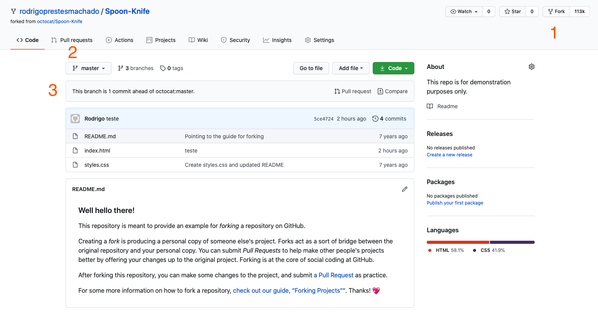

# Análise estática: PMD

Antes de iniciarmos o assunto sobre inspeções estáticas, iremos conhecer o conceito de *Fork* existente em sistemas de versionamento de código. Uma vez entendido o funcionamento de um *Fork*, no final desse documento iremos trabalhar com um exemplo onde iremos utilizar o *Fork* para poder analisar um código de forma estática.

## GitHub Fork

No Github, você pode utilizar o projeto de outra pessoa para estudar, contribuir ou utilizar como ponto de partida para o desenvolvimento de um novo projeto. Para isso, usamos a ferramenta *Fork* para criar uma cópia do projeto de outra pessoa. Iremos utilizar o *Fork* do GitHub para que vocês possam realizar os testes e encontrar erros nos repositórios de exemplo da disciplina. No GitHub, a funcionalidade de *Fork* (bifurcação) se localiza no canto direto superior da página de um repositório, observe o item 1 da figura 1.

Depois de criar um *Fork* de um repositório você deve fazer um `git clone` do projeto para a sua máquina para poder trabalhar com os arquivos. Uma vez criado, o clone permite que você altere os arquivos no editor de sua preferência (ex.: vscode) e versione o código por meio das operações [commit](https://docs.github.com/pt/desktop/contributing-and-collaborating-using-github-desktop/committing-and-reviewing-changes-to-your-project) (alterações no código localmente) e [push]( https://docs.github.com/pt/desktop/contributing-and-collaborating-using-github-desktop/pushing-changes-to-github) (enviar os commits para o repositório remoto).

<center>

<br/>
Figura 1 - Interface Web do GitHub
</center>

Depois de fazer alterações nos códigos do projeto, você poderá solicitar que as mudanças sejam incorporadas no projeto original. Para fazer isso, temos que criar um *Pull Request*, veja a localização dessa funcionalidade no item 2 da figura 1. Depois de criar um *Pull Request*, o GitHub mostrará um banner avisando que você realizou uma Pull Request para o projeto original, conforme mostra o item 3 da figura 1.

Porém, para que as suas mudanças sejam incorporadas, o dono do projeto principal necessitará aceitar e, consequentemente fazer uma operação de [*merge*](https://git-scm.com/docs/git-merge) para unir a nova modificação no código principal, ou seja, aceitar ou não a requisição depende do dono do projeto original.

---
**Para saber mais:** Existe um [tutorial](https://guides.github.com/activities/forking/) do GitHub específico sobre esse assunto onde você poderá realizar um *Fork* de um projeto chamado [Spoon-Knife](https://github.com/octocat/Spoon-Knife) e verificar na prática o funcionamento desse recurso.

---

## PMD

Depois que você entendeu o conceito de *Fork*, iremos iniciar a trabalhar com a ideia de inspecionar  um código estaticamente, ou seja, analisar um programa sem colocá-lo em execução. Todos os artefatos de um projeto podem ser inspecionados, como por exemplo: requisitos, modelos UML, trechos de código, etc.Os artefatos podem ser analisados manualmente por meio de revisões por pares e/ou *checklists*. Porém quando pensamos em inspeções em código fonte, atualmente contamos com um grande conjunto de ferramentas capazes de realizar esse tipo específico de análise.

Nesse sentido, o [PMD](https://pmd.github.io) é uma ferramenta capaz de analisar códigos fonte normalmente escritos em Java. O PDM possui um conjunto grande de [regras](https://pmd.github.io/pmd-6.27.0/pmd_rules_java.html) de análise que são capazes de apurar desde o estilo do código até questões mais complexas como segurança e desempenho. Além disso, existe a possibilidade de se criar novas regras no PMD, ou seja, essa característica garante uma boa flexibilidade e, consequentemente, uma possibilidade de adaptar seu uso em diferentes tipos de projeto Java.

Uma ferramenta como o PMD pode ser utilizada durante a fase de desenvolvimento e/ou fazer parte das etapas de construção e instalação de um sistema, assim, as próximas seções são dedicadas para mostrar o uso do PMD nesses dois contextos.

---
**Para saber mais:** O PMD está sendo utilizado como um exemplo nesse documento, porém, existem muitas outras ferramentas capazes de fazer o mesmo tipo de análise, um exemplo disso é o [SonarLint](https://www.sonarlint.org), que também possui possui extensões para [Vscode](https://marketplace.visualstudio.com/items?itemName=SonarSource.sonarlint-vscode), Eclipse, IntelliJ, entre outros. Também cabe salientar que ferramentas de inspeção de código estático não são uma exclusividade de Java, ou seja, em praticamente todas as linguagens você encontrará sistemas desse tipo.

---

## PMD no Vscode

O vídeo abaixo mostra um exemplo simples de como podemos configurar e utilizar o PDM dentro do Vscode. O vídeo tem o foco em três pontos, são eles: (1) a criação de um projeto por meio dos plugins [Java Extension Pack](https://marketplace.visualstudio.com/items?itemName=vscjava.vscode-java-pack) e [Maven for Java](https://marketplace.visualstudio.com/items?itemName=vscjava.vscode-maven) para VScode, (2) a configuração de regras para o PDM e o uso das regras dentro do VScode por intermédio do plugin [Apex PMD](https://marketplace.visualstudio.com/items?itemName=chuckjonas.apex-pmd).

<center>
    <iframe
    width="560" height="315"
    src="https://www.youtube.com/embed/ZgTtVUx6dcQ"
    frameborder="0"
    allow="accelerometer; autoplay; clipboard-write; encrypted-media; gyroscope; picture-in-picture"
    allowfullscreen>
    </iframe>
</center>

## Regras do PMD

Como foi mostrado no vídeo, o PDM possui um conjunto grande de regras, assim, os exemplos abaixo mostram regras consideradas úteis por diversos programadores, são elas:

---
**Nota:** as regras e explicações abaixo foram escritas de maneira colaborativa.

---

1. Best Practices
1. Code Style
1. Design
1. Documentation
1. Error Prone
1. Multithreading
1. Performance
1. Security
1. Additional rulesets
1. PMD com o Maven

## Best Practices

### 1. Remoção de imports não utilizados (Unused Imports)

@jaquelinebonoto - Às vezes quando estamos desenvolvendo, precisamos importar bibliotecas para uso. Essas bibliotecas facilitam o desenvolvimento, no entanto, seu carregamento pode causar problemas com desempenho, devido a importação destas bibliotecas. Em algum momento, importamos a biblioteca para o desenvolvimento de um bloco de código, mas, por exemplo, quando refatoramos um código, muitas vezes um biblioteca deixa de ser necessária. Desse modo, apagamos algum trecho de código, mas o `import` da biblioteca pode equivocadamente continuar presente. O linter pode nos ajudar a identificar `imports` não utilizados através de sua análise estática.

Exemplo:
```java
import java.io.File;  // not referenced or required
import java.util.*;   // not referenced or required

public class Foo {}
```

###  2. Usar Assert Equals ao invés de Assert True em testes unitários (UseAssertEqualsInsteadOfAssertTrue)

@jaquelinebonoto - Ao realizar testes unitários em nosso código, queremos saber se o valor devolvido pelo nosso código é o esperado. O time pode definir que para essa comparação - de valor real e de valor esperado seja feita através de Assert True ao invés de Assert Equals. Os dois podem funcionar adequadamente, mas como disse, o time pode optar por usar Assert True. Entenda no exemplo a seguir:

Exemplo:

```java
public class FooTest {

    @Test
    void testCode() {
        Object a, b;
        assertTrue(a.equals(b));                    // usa o equals da linguagem para comparar valores. inadequado neste caso
        assertEquals("a should equals b", a, b);    // usa o equals do framework de testes. Correto de acordo com a regra
    }
}
```

### 3. Baixo acoplamento (LooseCoupling)

@mottin-gui O uso de implementações de interfaces (por exemplo, `ArrayList`) limita a capacidade de alterações futuras que venham a ser necessárias por mudanças nos requisitos. Idealmente, deve se utilizar a interface adequada ao declarar objetos - e então inicializar o objeto com a implementação desejada.

Exemplo:

```java
public class BaixoAcoplamentoTest {

    // uso da interface List para então inicializar uma implementação de um ArrayList
    private List<AlgumTipo> lista = new ArrayList<AlgumTipo>();

    // mais um exemplo de uso de uma interface e uma de suas implementações visando o baixo acoplamento
    public Set<AlgumTipo> getFoo(){
        return new HashSet<AlgumTipo>();
    }
}
```

Para referenciar essa regra no PMD, use a linha abaixo:

```xml
    <rule ref="category/java/bestpractices.xml/JunitUseExpected"/>
```

### 4. SystemPrintln (prioridade média-alta)

@mottin-gui Referências à saída padrão do sistema (out e err) geralmente são utilizadas para debug de código, entretanto podem permanecer 'esquecidas' no código e entrar em produção. Por meio do `Logger` é possível habilitar ou não o registro das chamadas de debug e evitar que o log de saída padrão do sistema fique poluído.

Exemplo:
```java
public class Foo{
    Logger log = Logger.getLogger(Foo.class.getName());
    public void test(){
        // evitar usar
        System.out.println("Entrei no teste A");

        // melhor usar
        log.fine("Entrei no teste A");
    }
}
```

## PMD no Maven

O PDM possui um [plugin](https://maven.apache.org/plugins/maven-pmd-plugin/) para Maven, ou seja, existe a possibilidade de se incorporar inspeções estáticas dentro do processo de integração contínua. Portanto, antes mesmo de compilarmos um código, podemos realizar uma análise e, por meio de parâmetros de qualidade, decidir se iremos ou não continuar com a integração de um novo trecho de código (funcionalidade, correção de defeitos, etc.) em um sistema.

O plugin do PMD para o Maven possui quatro *goals*, são eles:

1. `pmd:pmd` - cria um relatório do PMD com base nos conjuntos de regras e configurações definidas no plugin.
1. `pmd:cpd` - gera um relatório para o Copy/Paste Detector (CPD) do PMD.
1. `pmd:check` - verifica se o relatório PMD está vazio, se não, falha o processo de *build*. Esse *goal* é executado por padrão quando `pmd:pmd` for invocado.
1. `pmd:cpd-check` - verifica se o relatório de CPD está vazio, se não, falha o processo de *build*. Esse *goal* é executado por padrão quando `pmd:cpd` for invocado.

Um *goal* de um plugin representa uma tarefa específica que contribui para a construção e gerenciamento de um projeto. A ordem de execução depende da ordem em que o(s) goal(s) e as fases de construção (*build*) são invocadas. No exemplo abaixo, os argumentos `clean` e `package` são fases do *build* e `pmd:pmd` é um um goal do plugin PMD.

    mvn clean pmd:pmd package

---
**Para saber mais:** No Maven, existe a ideia de que um ciclo de *build* compreende um conjunto de fases. Por exemplo, um ciclo no Maven pode possuir as fases: *validate*, *compile*, *test*, *package*, *verify*, *install* e *deploy*. Assim,  no Maven acesse essa [documentação](https://maven.apache.org/guides/introduction/introduction-to-the-lifecycle.html) disponível.

---

Finalmente, para configurar o PMD em um projeto Java/Maven, temos que declarar o plugin do PMD dentro da seção de plugins do pom.xml do projeto da seguinte maneira:

```xml
<plugin>
<groupId>org.apache.maven.plugins</groupId>
<artifactId>maven-pmd-plugin</artifactId>
<version>3.13.0</version>
<configuration>
    <rulesets>
        <ruleset>/category/java/bestpractices.xml</ruleset>
        <ruleset>pmd.xml</ruleset>
        <ruleset>https://raw.githubusercontent.com/rodrigoprestesmachado/tpack/master/pmd.xml</ruleset>
    </rulesets>
</configuration>
</plugin>
```

Conforme mostra o exemplo acima, o plugin do PMD no Maven possui um conjunto de regras [pré-definidas](https://maven.apache.org/plugins/maven-pmd-plugin/examples/usingRuleSets.html) chamadas de *best practices* (`/category/java/bestpractices.xml`). Porém, podemos adicionar um conjunto de regras próprias por meio de um arquivo XML e/ou por meio de uma URL.

Depois de modificar o `pom.xml` de um projeto, podemos executar (no diretório do `pom.xml`) um dos *goals* do plugin do PMD, por exemplo:

    mvn pmd:pmd

Note que no exemplo acima, estamos executando apenas um *goal* do plugin, ou seja, não estamos considerando um ciclo de *build* completo. Depois de executado, o relatório do PMD estará disponível dentro de `target/pmd.xml`.

🚨 Experimente executar o PMD no projeto [TPACK](https://github.com/rodrigoprestesmachado/tpack) seguindo o seguinte [tutorial](https://katacoda.com/rodrigoprestesmachado/scenarios/pmd) do Katacoda

Uma dica de complemento para o PMD no Maven pode ser alcançado por meio do plugin [Checkstyle](https://maven.apache.org/plugins/maven-checkstyle-plugin/). Como o nome indica, o Checkstyle tenta fazer com que os desenvolvedores de uma equipe escrevam códigos dentro de um determinado padrão, como por exemplo,  [Sun Code Conventions](https://checkstyle.org/styleguides/sun-code-conventions-19990420/CodeConvTOC.doc.html) ou [Google Java Style](https://checkstyle.org/styleguides/google-java-style-20180523/javaguide.html).

## Codebeat

Atualmente, existem diversas ferramentas na Web capazes de realizar inspeções estáticas em um projeto, um exemplo desse tipo de ferramenta é o [codebeat.co](https://codebeat.co). Por se tratar de uma ferramenta gratuíta para repositórios públicos (GitHub, Bitbucket, Gitlab, etc.) e bastante abrangente (com suporte para várias linguagens) o codebeat e outras ferramentas do mesmo estilo na Web podem se mostrar interessantes no desenvolvimento de projetos de código aberto.

<center>
<a href="https://rpmhub.dev" target="blanck"></a><br/>
<a rel="license" href="http://creativecommons.org/licenses/by/4.0/">Creative Commons Atribuição 4.0 Internacional</a>
</center>