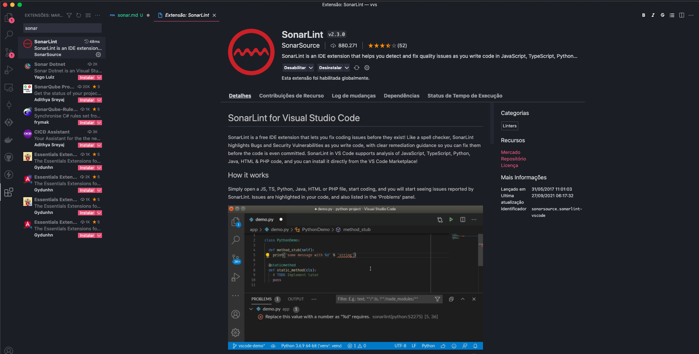
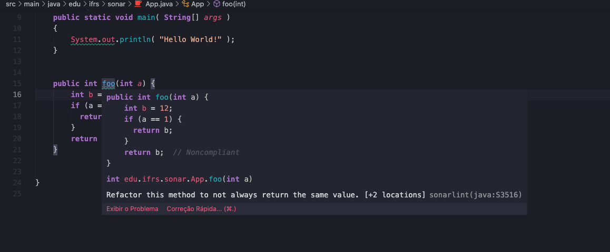

# Sonar

<center>
    <iframe src="https://vvs.rpmhub.dev/sonar/slides/index.html#/"
    title="Sonar"
    width="90%" height="500" style="border:none;">
    </iframe>
</center>

## Resumo 📝

O [SonarLint](https://www.sonarlint.org) é uma ferramenta de inspeção estática
que auxilia um programador na identificação e correções de problemas de
codificação. O [SonarLint](https://www.sonarlint.org) está disponível para
diversas IDEs (_Integrated Development Environment_) como por exemplo:
[VSCode](https://code.visualstudio.com), [Eclipse](https://www.eclipse.org/),
[Intellij](https://www.jetbrains.com/pt-br/idea/), entre outros e, possui um
conjunto grande de [regras](https://rules.sonarsource.com) para análise de
código JavaScript, TypeScript, Python, Java, HTML, PHP, entre muitas outras.
😀

Utilizando uma variedade de regras e padrões de boas práticas de programação,
o SonarLint verifica o código à medida que é digitado, destacando possíveis
_bugs_, vulnerabilidades de segurança, violações de convenções de codificação e
outras questões de qualidade de código. Isso permite que os desenvolvedores
corrijam esses problemas imediatamente, enquanto estão escrevendo o código,
o que ajuda a reduzir o tempo e os custos associados à identificação e correção
de problemas mais tarde no ciclo de desenvolvimento.

### SonarLint no VSCode 🖥️

Para instalar o SonarLint no VSCode, basta procurar o pacote no
[Marketplace](https://marketplace.visualstudio.com/items?itemName=SonarSource.sonarlint-vscode)
e clicar no botão `Install`. Alternativamente, você pode utilizar o próprio
Visual Studio Code para instalar o SonarLint por meio das extensões, nesse caso,
pesquise por SonarLint que você encontrará a extensão para VSCode, a imagem
abaixo ilustra esse processo:

<center>
    <a href="https://marketplace.visualstudio.com/items?itemName=SonarSource.sonarlint-vscode">
        
    </a>
    <br/>
    Figura 1 - Instalação do SonarLint no VSCode
</center>

Faça um teste para verificar se o SonarLint está configurado no seu VSCode.
Primeiro, abra um terminal e digite o seguinte comando do Maven:

    mvn archetype:generate -DarchetypeGroupId=org.apache.maven.archetypes -DarchetypeArtifactId=maven-archetype-quickstart -DarchetypeVersion=1.4

O comando acima é utilizado para criarmos um projeto Java simples a partir do
Maven. Durante a criação do projeto, o Maven irá perguntar sobre o
[grupoId](https://maven.apache.org/guides/mini/guide-naming-conventions.html)
(uma identificação do seu projeto dentro de todos projetos Maven) e o
[artifactId](https://maven.apache.org/guides/mini/guide-naming-conventions.html)
(o nome do seu .jar sem a versão). Depois de escolher o grupoId e o artifactId,
o Maven irá criar um diretório, utilize o comando `code [nome do artifactId]`
para abrir o projeto no VSCode.

⚠️ **Importante:** para fazer esse teste, se certifique que o VSCode esteja
instalado com as extensões do Java, caso não esteja, assista o início desse
[vídeo](https://www.youtube.com/embed/ZgTtVUx6dcQ).

Uma vez que você tenha aberto o seu projeto no VSCode, procure a classe
`App.java` dentro do diretório `src` e adicione o seguinte método:

```java
public int foo(int a) {
  int b = 12;
  if (a == 1) {
    return b;
  }
  return b;  // Noncompliant
}
```

Se o SonarLint estiver rodando com sucesso, você verá um alerta conforme a
figura abaixo: 👊

<center>
    
    <br/>
    Figura 2 - SonarLint no VSCode
</center>

O alerta ocorreu pois o método `foo` possui dois retornos, e a
regra [Methods returns should not be invariant](https://rules.sonarsource.com/java/type/Code%20Smell/RSPEC-3516)
foi acionada.

O SonarLint possui um conjunto grande de [regras](https://rules.sonarsource.com/)
 para análise de código, que podem ser utilizadas para identificar problemas de
 codificação. No caso de Java, por exemplo, atualmente o SonarLint possui mais
 de 600 regras divididas entre as categorias vulnerabilidades, defeitos,
 segurança e boas práticas. ⬆️

### Exemplos de regras do SonarLint para Java 🚀

A seguir, listamos algumas das [regras](https://rules.sonarsource.com/java/) do
SonarLint para Java:

* [Methods returns should not be invariant](https://rules.sonarsource.com/java/type/Code%20Smell/RSPEC-3516):
Este método sempre retorna o mesmo valor. Isso pode ser um erro.
* [Classes should not be coupled to too many other classes](https://rules.sonarsource.com/java/type/Code%20Smell/RSPEC-1200):
Classes não devem estar acopladas a muitas outras classes.
* [Public types, methods and fields (API) should be documented with Javadoc](https://rules.sonarsource.com/java/type/Code%20Smell/RSPEC-1176/):
Tipos, métodos e campos públicos (API) devem ser documentados com Javadoc.
* [Recursion should not be infinite](https://rules.sonarsource.com/java/type/Bug/RSPEC-2190/):
A recursão não deve ser infinita.
* [Regular expressions should be syntactically valid](https://rules.sonarsource.com/java/type/Bug/RSPEC-5856/):
As expressões regulares devem ser sintaticamente válidas.
* [Database queries should not be vulnerable to injection attacks](https://rules.sonarsource.com/java/type/Vulnerability/RSPEC-3649/):
As consultas de banco de dados não devem ser vulneráveis a ataques de injeção.

## Sonar Cloud 🌐

O [Sonar Cloud](https://sonarcloud.io) é uma plataforma de análise de código
hospedada na nuvem que permite que você verifique a qualidade do seu código
com facilidade. O [Sonar Cloud](https://sonarcloud.io) é uma ferramenta
gratuita para projetos de código aberto e possui integração com o GitHub,
Bitbucket e Azure DevOps. A plataforma oferece suporte a várias linguagens
de programação, incluindo Java, JavaScript, TypeScript, Python, C#, C/C++,
PHP, entre outras.

### Configuração do Sonar Cloud no GitHub 🚀

Para configurar o Sonar Cloud no GitHub, siga os passos abaixo:

1. Acesse o [Sonar Cloud](https://sonarcloud.io) e faça login com a sua conta
2. Clique em `Create Project` e escolha o repositório que você deseja analisar
3. Clique em `Set Up` e siga as instruções para configurar o seu repositório

## SonarQube 🌐

O [SonarQube](https://www.sonarqube.org) é uma plataforma de análise de código
hospedada localmente que permite que você verifique a qualidade do seu código
com facilidade. O [SonarQube](https://www.sonarqube.org) é uma ferramenta
gratuita para projetos de código aberto e possui integração com o GitHub,
Bitbucket e Azure DevOps. A plataforma oferece suporte a várias linguagens
de programação, incluindo Java, JavaScript, TypeScript, Python, C#, C/C++,
PHP, entre outras.

## Questões 📚

<center>
    <iframe src="https://vvs.rpmhub.dev/sonar/slides/questions.html"
        title="Sonar" width="90%" height="500" style="border:none;">
    </iframe>
</center>

## Exercício Prático 🚀

Configure o SonarCloud em um dos seus repositórios no GitHub e faça um _pull
request_ para verificar a qualidade do seu código. 🤓

Lembre-se que o SonarCloud é uma ferramenta gratuita que suporta um número
ilimitado de projetos de código aberto e linguagens de programação. 🌐

## Referências 📚

* [SonarLint](https://www.sonarlint.org). Acesso em 05 de março 2024.
* [Sonar Cloud](https://sonarcloud.io). Acesso em 05 de março 2024.
* [SonarQube](https://www.sonarqube.org). Acesso em 05 de março 2024.


<center>
<a href="https://rpmhub.dev" target="blanck"></a><br/>
<a rel="license" href="http://creativecommons.org/licenses/by/4.0/">CC BY 4.0 DEED</a>
</center>